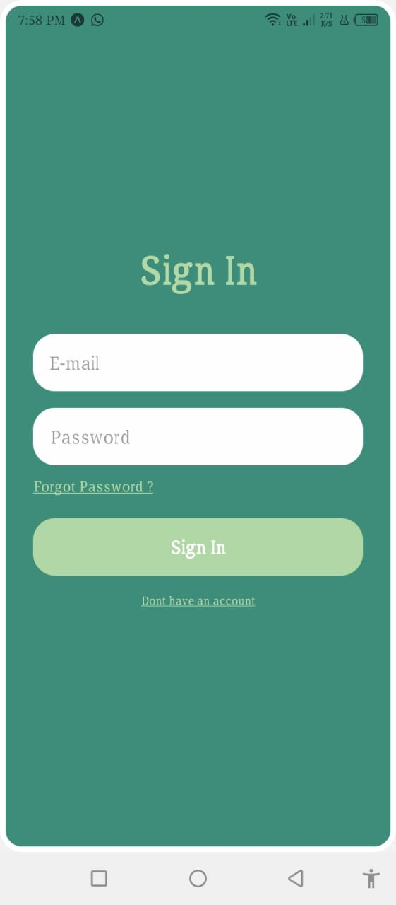
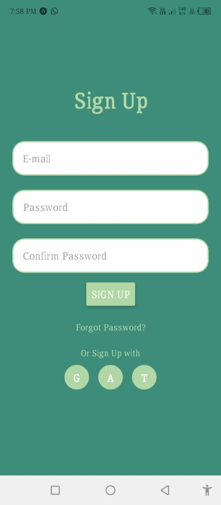
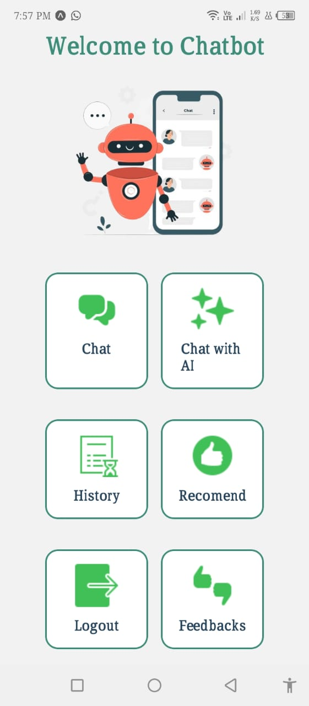
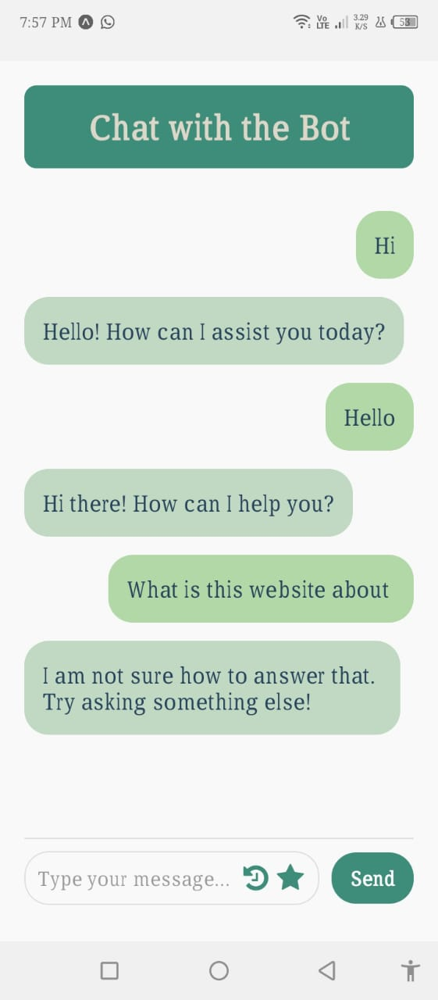

Awesome! Here's a completed version of your `README.md` with the missing parts filled in, including dependencies, build instructions, and a link placeholder for your build file (you can update it with your actual link):

---

```markdown
# 💬 Rule-Based Chatbot App

A mobile-friendly **Rule-Based Chatbot** built using **React Native (Expo)** for the frontend and **Express.js** for the backend. This chatbot responds to predefined patterns and keywords to simulate a conversation without relying on third-party APIs.

## 📱 Features

- 📋 Rule-based logic with keyword detection
- 🔄 Real-time messaging experience
- ⚡ Lightweight and fast responses
- 📲 Mobile UI built using React Native (Expo)
- 🧠 No external APIs — everything is handled internally

## 🛠️ Tech Stack

- **Frontend**: [Expo (React Native)](https://expo.dev/)
- **Backend**: [Express.js](https://expressjs.com/)
- **Communication**: RESTful API between frontend and backend
- **Language**: JavaScript (Node.js & React Native)

## 📸 Screenshots

### LogIn Page


### SignUp Page


### Home Page


### Chat Page


## 🧑‍💻 Getting Started

### 🔧 Prerequisites

Make sure you have the following installed:

- Node.js & npm
- Expo CLI (`npm install -g expo-cli`)
- Git

### 📦 Installation

#### 1. Clone the Repository

```bash
git clone https://github.com/Sumairahafeez/Chatbot.git
cd Chatbot
```

#### 2. Setup Backend (Express.js)

```bash
cd backend
npm install
node server.js
```

> By default, the backend runs on `http://localhost:3000`

#### 3. Setup Frontend (React Native using Expo)

In a new terminal window:

```bash
cd frontend
npm install
expo start
```

> Scan the QR code with the Expo Go app or run it on an emulator.

## 📂 Project Structure

```bash
Chatbot/
├── backend/
│   ├── server.js
│   └── chatbotLogic.js
├── frontend/
│   ├── App.js
│   ├── assets/
│   ├── components/
│   └── screens/
├── screenshots/
│   ├── LogInUI.jpg
│   ├── SignUpUI.jpg
│   ├── HomeUI.jpg
│   └── chatUI.jpg
└── README.md
```

## 📦 Dependencies

### Frontend (Expo)

- `react-native`
- `axios`
- `expo`
- `react-navigation`
- `react-native-gesture-handler`
- `react-native-reanimated`

> Add other dependencies if you’re using additional libraries like `formik`, `yup`, etc.

### Backend (Express.js)

- `express`
- `cors`
- `body-parser` (optional)

## 🚀 Build/Deploy

To create a production-ready build of your app:

```bash
expo build:android
```

Or for EAS Build:

```bash
eas build --platform android
```

### 📱 Download APK

You can download the latest build here:

👉 [Download Chatbot APK](https://expo.dev/accounts/sumaira_1/projects/myChatbotApp/builds/156dae59-3cdb-4415-8715-401052a87a03)
---

## 🤖 How It Works

- User messages are sent from the frontend to the Express.js backend.
- The backend matches keywords or phrases against a rule-based logic file (`chatbotLogic.js`).
- The matched response is sent back to the frontend to be displayed.

## 📌 Future Enhancements

- 📝 Add more conversational rules and conditions
- 🌍 Support for multiple languages
- 🗃️ Save chat history with local storage or database
- 🎤 Add voice input/output features

## 👩‍💻 Author

Made with ❤️ by [Sumaira Hafeez](https://github.com/Sumairahafeez)

---

```

Let me know if you're using `EAS` or `classic build` on Expo and whether your app is already uploaded somewhere so I can help you generate a proper download link or QR!